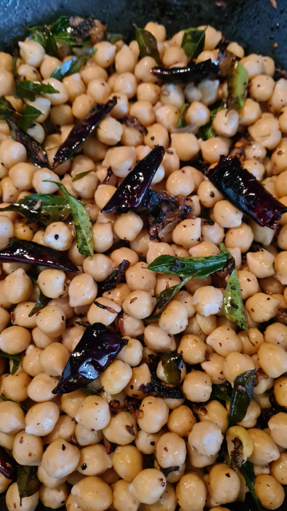

# Kadala Thel dala (Stir fired Chickpeas)

## Ingredients

* 3 tbsp of Oil
* Handful of curry Leaves
* 1 large Onion Sliced fine
* 1 tsp of Mustard seeds
* 1 tsp cumin seeds
* 1 tsp of red chilli flakes( add more if needed)
* 2-3 Dried red chillies(optional)
* 1/2 tsp Salt to taste
* 2 cups of Chickpeas(soaked overnight).
* 1/2 cup sliced coconut (optional)

__Notes-__ you can use canned chickpeas as well.

## Method

* Soak the chickpeas overnight, if you are in a rush to make these use canned chickpeas so that you save time as well.
* Cook chickpeas with 1 teaspoon of Salt.
* If you are cooking the chickpeas over a stove top cook for 30-45 minutes.
* If you use a pressure cooker, the chickpeas should be done by the third whistle.
* Once cooked, drain and set aside.
* __Note:__ Don't throw the water - add garlic and ginger to it and drink this drained water.
* Heat oil in a pan, add mustard seed and cumin. Fry for few minutes till the seeds pop. You might want to close the pan with a lid so that the seeds will not pop out of the pan.
* Add the rest of the ingredients except the chickpeas and fry till the onions are gold brown.
* Finally add the chickpeas, add salt taste. Fry for another 2-3 minutes. Serve hot.

