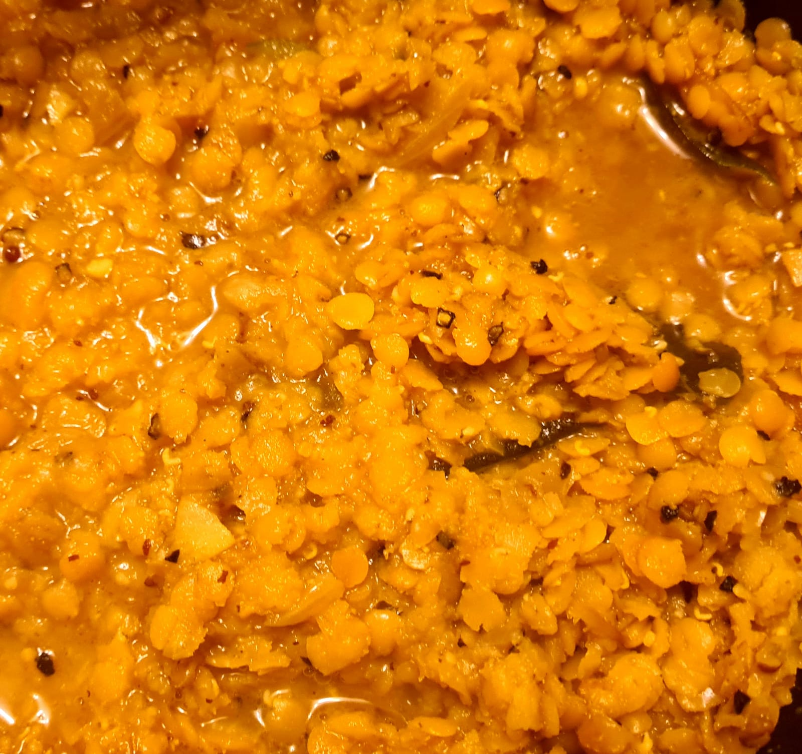

# Dhal (Parippu)

## Ingredients

* 3 cups red lentils
* 4.5 cups water
* 1 onion chopped
* 1 small tomato chopped
* 2 tsp ginger minced
* 6 cloves garlic sliced
* 2 green chili diced
* 2 sprigs curry leaves
* 1 tsp turmeric powder
* 1 tsp cumin powder
* 1 tsp coriander powder
* 1 tsp coriander seeds
* 1 tsp salt
* 1 cup of coconut milk (optional)
* 1 oil for frying
* 1 tsp mustard seeds
* 5 dried chili broken to pieces

## Method
* Rinse the red lentils until the water runs clear.
* Into a pot add red lentils, fill the pot with water and leave it for an hour (water get absorbed by lentils and the volume expands)
* Drain the water off the pot
* In a non-stick pan, heat the oil and add mustard seeds, coriander seeds, curry leaves, broken dried red chili, chopped onion, minced ginger, sliced garlic, green chili and Cook until the mustard seeds start to splutter.
* Add lentils and fry for few miniutes.  Then Add turmeric powder, cumin powder, coriander powder and salt. Fry until the lentils turn colour yellow from red.
* Turn the heat to low, add water, tomato and cover the pot and cook the lentils until all the water is absorbed and lentils are cooked through.
* (optional) Add the coconut milk abd stir to combine. Cover and let it simmer for 5 minutes.

