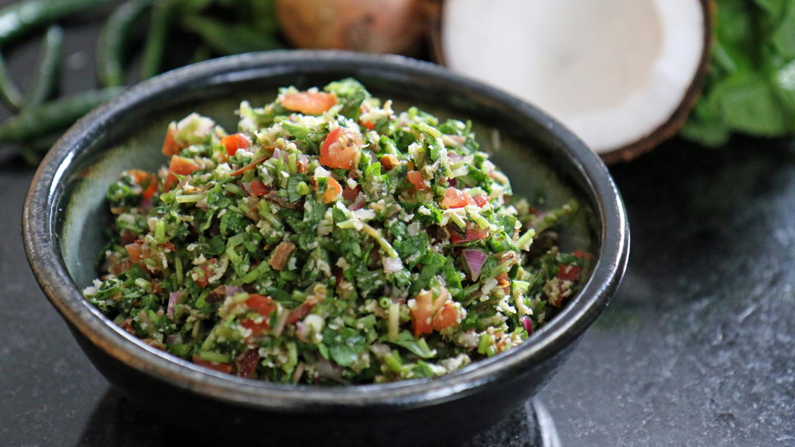

# Gotu Kola Sambol

## Ingredients

* small bunch of gotu kola, washed (alternatively use curly leaf parsley or curly kale)
* 1 large tomato, finely chopped
* 1 small green finger chilli, finely sliced
* 6 small red onions, finely sliced (1/4 of a large Bombay Onion)
* 6 tbsp of fresh grated coconut (alternatively use 200g fresh coconut flakes)
* 1 tbsp Maldive fish flakes (dried tuna flakes, also known as Maldive chips)
* ½ lime, juice only
* ½ tsp of ground pepper
* table salt, to taste

## Method

* Finely chop the gotu kola, including the stalks, and place in a large bowl. Add the tomatoes, chilli, pepper and onions and mix together.
* Using a coconut scraper, scrape out the coconut flesh into a bowl. Add a couple of handfuls of coconut flesh to the bowl, along with the Maldive fish flakes, lime juice and a little salt. Mix well to combine, taste and add more salt if desired.

