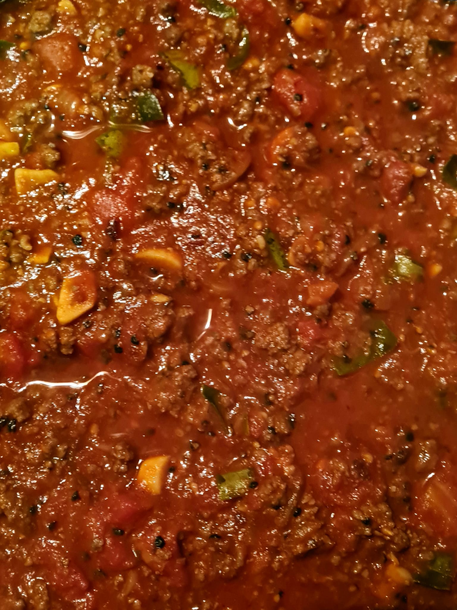
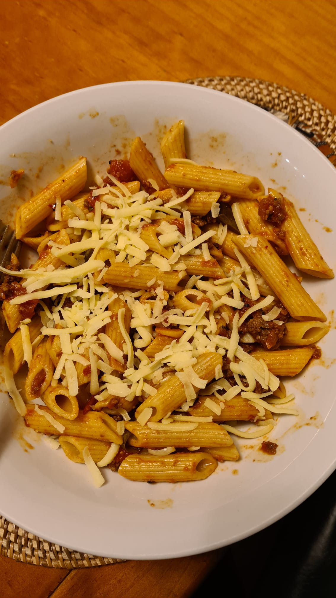

# Arrabiata Pasta with Mince meat

## Ingredients

* 400g penne rigate
* 2 tbsp olive oil
* 1 Large brown onion, finely chopped
* 2 garlic cloves, finely chopped
* 1 tbsp of chilli flakes / powder
* 3 small red chillies, halved, deseeded, finely chopped
* 1 tbsp tomato paste
* 2 x 400g cans whole peeled tomatoes
* 40g baby rocket leaves
* few curry leaves

### Mince meat marinate 
* 500 g of mince meat
* 1 tsp of salt.
* 3 tsp of pepper powder
* 3 tsp of cumin powder.
* 1/4 cup of oil to fry the beef
* 1 tbsp of crushed Garlic and Ginger.
* 3 tbsp Balsamic vinegar 

## Instructions

* Season the beef with salt, cumin and pepper powder, vinegar, garlic and ginger.
* Cook pasta in a large saucepan of boiling, Add 1 tsp of salt and 2 tbsp of olive oil to the boiled water and follow packet directions, until tender. Drain pasta and return to pan.
* Heat oil in a large frying pan over medium heat. Add onion, garlic, curry leaves and fry until onions get soft.
* Add chillies and beef and fry until beef is cooked.
* Add tomato paste, tomatoes for 15 minutes or until sauce thickens. Season with salt and pepper. Toss with pasta. Add rocket and serve

